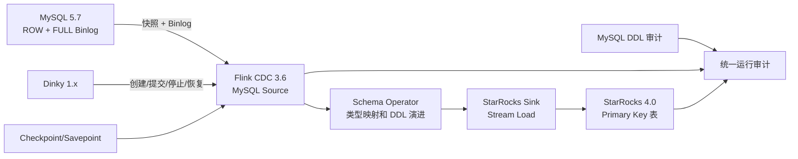
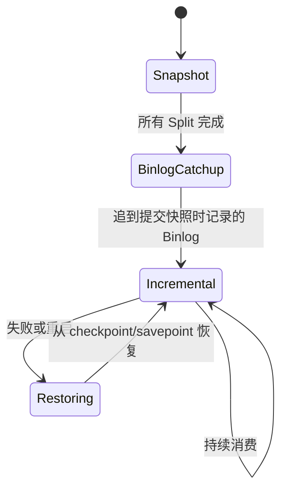

# MySQL CDC 到 StarRocks 生产部署与运行手册

本文沉淀 ERP 全库从 MySQL 通过 Dinky 管理的 Flink CDC Pipeline 同步到 StarRocks 的完整产品链路。目标是让新服务器部署、全量转增量、日常运维和故障恢复都有可重复的步骤，不依赖某一次会话或某一个 Job ID。

配套模板位于 `deploy/docker/erp-cdc/`。模板不包含密码、Dinky Token、公网地址或生产证书。

## 1. 目标与验收标准

本方案的目标不是“任务能启动”，而是同时满足以下条件：

1. 任务必须从 Dinky 创建、提交、停止和恢复，Dinky 中能看到任务及实例。
2. 首次启动执行全量快照，快照结束后自动持续读取 MySQL Binlog。
3. 全量阶段稳定吞吐不低于 30,000 行/秒，不能通过无上限增加内存换取瞬时速度。
4. 只同步表名合法、有主键、类型可映射且通过预检的表。
5. MySQL 表和字段注释能够安全生成 StarRocks DDL，支持引号、反斜杠、换行和中文标识符。
6. 能处理并审计 `CREATE TABLE`、`ALTER TABLE`、`DROP TABLE` 和 `TRUNCATE TABLE` 等上游 DDL。
7. 意外重启后从 checkpoint/savepoint 恢复，不重新做全量，也不丢失已确认的 Binlog 位点。
8. 源端与目标端能够按表执行行数、主键范围和抽样内容校验。

## 2. 产品链路



数据和控制面需要分开理解：

| 层面 | 责任 | 不能替代的能力 |
| --- | --- | --- |
| MySQL | 原始表、全量数据、ROW Binlog、原始 DDL 审计 | ROW Binlog 不保存原始 DML SQL |
| Flink CDC | 快照切分、Binlog 位点、Schema Event、容错状态 | TaskManager 日志不是完整 SQL 审计 |
| Dinky | 任务目录、配置、提交、实例、监控入口 | Dinky 不是数据存储，也不能代替 checkpoint |
| StarRocks | 自动建表、Primary Key Upsert/Delete、Stream Load | Stream Load 不是逐条 `INSERT/UPDATE/DELETE` SQL |

## 3. 当前基线

下表是 2026-08-14 的运行基线。新服务器应固定版本，不使用 `latest`。

| 项目 | 当前值 | 迁移要求 |
| --- | --- | --- |
| Dinky 镜像 | `ghcr.io/yezh1i/dinky-standalone-server:sha-10d198a`，部署模板固定到 digest `0472f5b...32b02` | 必须使用包含本项目补丁的固定镜像或其后续已验收镜像 |
| Flink | 1.20.3，Java 11 | 不跨版本直接恢复状态 |
| Flink CDC | 3.6.0-1.20 | Connector JAR 与 Flink 版本一致 |
| StarRocks | 4.0.14 | FE/BE 使用同一版本 |
| MySQL | 5.7.20-log | `log_bin=ON`、`binlog_format=ROW`、`binlog_row_image=FULL` |
| MySQL Binlog 保留 | 30 天 | 必须覆盖最长停机、迁移和回滚窗口 |
| 当前主任务并行度 | 16 | 16 个唯一 MySQL server-id |
| Checkpoint | 60 秒 | 只允许 1 个并发 checkpoint |
| 当前目标库 | `dinky_cdc_erp_v3` | 新环境先使用新库名验证，禁止覆盖旧环境 |
| StarRocks 副本数 | 1 | 单 BE 只能为 1；生产 HA 使用 3 BE 和 3 副本 |
| StarRocks Buckets | 16 | 迁移后根据表大小复核 |

当前主任务的 ID 和 Job ID 只用于事故追踪，不能写死到部署脚本。新环境创建任务后会生成新的 ID。

### 3.1 当前已确认的配置缺口

1. 当前 Dinky 元数据使用容器内 H2 文件。迁移时必须停机复制，长期建议改为独立 MySQL。
2. 当前 checkpoint/savepoint 使用本机 `file://` 路径。跨服务器恢复时必须复制完整 savepoint，长期建议使用共享对象存储或 HDFS。
3. 当前任务 `autoRestart=false`。Flink 的 fixed-delay 只处理集群仍存活时的失败，不能替代 Dinky/容器重启后的自动拉起。
4. 当前单机只有约 16 GiB 内存，而 Dinky、Flink、StarRocks FE/BE 的最大内存承诺明显超过物理内存，已经发生过 Swap 用满。
5. 直接调用 `/api/task` 创建任务会缺少 Catalogue 关联，后续无法通过正常接口删除。必须通过 Catalogue + Task 接口创建。

## 4. 资源规划

### 4.1 推荐规格

对于约 500 张表、并行度 16、全量目标 30,000 行/秒的单机混部：

| 规格 | CPU | 内存 | 磁盘 | 用途 |
| --- | ---: | ---: | ---: | --- |
| 最低验证环境 | 8 vCPU | 32 GiB | 300 GiB SSD | 功能验证和低峰迁移，不作为长期生产 |
| 推荐单机 | 16 vCPU | 64 GiB | 500 GiB 以上 NVMe | 当前规模的稳定全量和增量 |
| 推荐生产 | Dinky/Flink 与 StarRocks 分机，StarRocks 3 BE | 每节点 64 GiB 以上 | 独立 NVMe | 消除单机故障和资源争抢 |

容量规划至少保留 30% 空闲内存和 30% 空闲磁盘。不要把 Linux Swap 当作可用内存。

### 4.2 当前 Flink 内存基线

```yaml
jobmanager.memory.process.size: 1280m
taskmanager.memory.process.size: 6144m
taskmanager.numberOfTaskSlots: 16
parallelism.default: 16
```

一个 TaskManager 的 `process.size` 与 Slot 数不是按 Slot 成比例缩小的。曾经为并行度 1 的临时任务额外启动了一个 1 Slot TaskManager，但它仍按 6 GiB 进程规格申请内存。任务取消后该进程没有自动退出，造成约 2.6 GiB 常驻内存残留。

部署后必须确认只有预期的 TaskManager：

```bash
curl -s http://127.0.0.1:8081/taskmanagers
docker stats --no-stream
```

如果出现“全部 Slot 空闲”的额外 TaskManager，先核对 ResourceID、日志文件和 PID，再正常终止。禁止按模糊进程名批量 `kill`。

## 5. 源端 MySQL 前置条件

### 5.1 必需变量

```sql
SHOW VARIABLES WHERE Variable_name IN (
  'log_bin',
  'binlog_format',
  'binlog_row_image',
  'server_id',
  'gtid_mode',
  'expire_logs_days',
  'binlog_expire_logs_seconds',
  'time_zone'
);
```

最低要求：

```text
log_bin          ON
binlog_format    ROW
binlog_row_image FULL
server_id        非 0
```

当前源端 `gtid_mode=OFF`，任务依赖文件名和 position 恢复。迁移期间绝不能提前清理旧 Binlog。当前 `expire_logs_days=30` 可以覆盖常规窗口，但仍应在迁移前确认最老 Binlog 时间。

### 5.2 CDC 账号权限

账号至少需要：

```sql
SELECT, RELOAD, SHOW DATABASES, REPLICATION SLAVE, REPLICATION CLIENT
```

权限应限制到实际源库，并通过 `SHOW GRANTS` 验证。账号密码不得出现在 Git、Compose 或运行手册中。

### 5.3 server-id 规则

并行度 16 使用 16 个唯一 ID，例如：

```yaml
server-id: 8001-8016
```

规则：

1. 同时连接同一 MySQL 的每个 CDC 任务必须使用互不重叠的范围。
2. 蓝绿迁移时，新旧任务会同时运行，新任务必须使用另一段范围，例如 `8201-8216`。
3. 删除任务后再回收范围，不要在旧连接仍存活时复用。

## 6. 表准入与显式白名单

禁止在生产直接使用：

```yaml
tables: 'haidb_new.\.*'
```

必须先执行 `deploy/docker/erp-cdc/preflight.sql`，再生成显式白名单。当前源库有 495 张基础表，主任务明确纳入 468 张，排除 27 张。

### 6.1 自动排除规则

1. 表名包含空白字符：排除。
2. 没有主键：排除。StarRocks Primary Key Upsert/Delete 无法保证无主键表的正确性。
3. 出现未覆盖的数据类型：排除并补充映射测试后再纳入。
4. 正则特殊字符没有正确转义：排除，不能直接拼入表名正则。
5. DDL/注释预检失败：隔离到 canary 任务验证。

当前自动排除：

```text
无主键:
  brand_temp2
  erp_order_delete_data
  task_nostockup_report
  wn_back_order
  xiaohuotmp
  xiaohuotmp2

表名包含空格:
  exchange_rate_first_working day
```

### 6.2 当前大表隔离清单

以下 20 张大表不进入主任务。它们需要独立资源、独立 server-id、独立目标库和独立验收：

```text
erp_order
shopify_discount
inventory_out_detail
picking_list
third_order
inventory_out
erp_order_delete_data
inventory_count
logistics_information_kuaidi100
inventory_inout
shipping_order
operate_log
outer_order
outer_order_detail
inventory_log
purchase_storage_detail
erp_order_fee
inventory_inout_finance
inventory_record
erp_order_nosku
```

`erp_order_delete_data` 同时属于“无主键”和“大表”两类，只计一次。`erp_order_danger_user` 当前为人工隔离表，元数据注释存在异常编码表现；重新纳入前必须单表 canary 验证。

## 7. 类型映射基线

以下为产品级映射目标。最终结果必须用 `SHOW CREATE TABLE` 验证，不能只相信配置文件。

| MySQL | StarRocks | 注意事项 |
| --- | --- | --- |
| TINYINT / TINYINT UNSIGNED | SMALLINT | 当前镜像已补丁修复 |
| SMALLINT | SMALLINT |  |
| SMALLINT UNSIGNED | INT | 由 CDC 源端 widening 后映射 |
| MEDIUMINT / MEDIUMINT UNSIGNED | INT |  |
| INT | INT |  |
| INT UNSIGNED | BIGINT |  |
| BIGINT | BIGINT |  |
| BIGINT UNSIGNED | LARGEINT | `DECIMAL(20,0)` 主键补丁，避免错误转 VARCHAR |
| BIT(M) | SMALLINT | 纳入前做边界值测试 |
| DECIMAL / NUMERIC | DECIMAL(p,s) | 普通 DECIMAL 主键仍可能转 VARCHAR，必须单独评审 |
| FLOAT | FLOAT |  |
| DOUBLE | DOUBLE |  |
| BOOL / BOOLEAN | BOOLEAN |  |
| DATE | DATE |  |
| DATETIME / TIMESTAMP | DATETIME | 时区统一为 Asia/Shanghai |
| TIME | VARCHAR | 保留原表示，避免语义损失 |
| YEAR | INT |  |
| CHAR | CHAR 或 VARCHAR | 主键或超长 CHAR 会转 VARCHAR |
| VARCHAR | VARCHAR | UTF-8 长度按 3 倍预留并限制上限 |
| BINARY / VARBINARY | VARBINARY |  |
| TEXT 系列 | STRING/VARCHAR | 以实际 Connector DDL 为准 |
| BLOB 系列 | STRING/VARBINARY | 必须进行二进制内容测试 |
| ENUM / SET | STRING/VARCHAR |  |
| JSON | JSON | 当前源库未出现，纳入前增加集成测试 |

当前源库已确认有 67 个 unsigned 字段、77 个非 ASCII 字段名和至少 1 个包含 `audited` 的字段注释。固定镜像包含以下补丁与测试：

1. TINYINT 到 SMALLINT。
2. BIGINT UNSIGNED 主键到 LARGEINT。
3. 表名、库名、列名统一使用反引号并转义反引号。
4. COMMENT 中引号、反斜杠、NUL、换行、回车、Tab 和 `0x1A` 统一转义。
5. `audited` 注释测试。
6. 中文库名、表名、字段名和表注释测试。
7. `TRUNCATE TABLE`、`DROP TABLE`、列重命名和类型变更 DDL 支持。

## 8. Pipeline 配置

完整脱敏模板见 `deploy/docker/erp-cdc/pipeline.template.yaml`。当前经过验证的性能基线：

```yaml
source:
  scan.startup.mode: initial
  scan.incremental.snapshot.chunk.size: 16384
  scan.snapshot.fetch.size: 2048
  connection.pool.size: 4

sink:
  sink.buffer-flush.max-bytes: 134217728
  sink.buffer-flush.interval-ms: 10000
  sink.scan-frequency.ms: 50
  sink.io.thread-count: 2
  sink.at-least-once.use-transaction-stream-load: false

pipeline:
  parallelism: 16
```

配置含义和风险：

| 参数 | 作用 | 调整原则 |
| --- | --- | --- |
| chunk.size | 增量快照切片大小 | 过大会增加单 Split 内存和长尾，过小会增加调度开销 |
| fetch.size | JDBC 每次抓取行数 | 2048 是当前平衡点，不随意扩大到几万 |
| connection.pool.size | 元数据/JDBC 连接池 | 不等于并行度，避免压垮源 MySQL |
| buffer-flush.max-bytes | 每个 Sink Writer 缓冲上限 | 并行度 16 时按 Writer 放大估算总内存 |
| flush.interval | 增量可见延迟 | 10 秒适合吞吐优先；低延迟任务单独配置 |
| io.thread-count | Sink I/O 线程 | 先观察 BE 和网络，再增加 |

全量性能必须使用 5 分钟以上窗口统计，不能用单秒峰值。目标是稳定 30,000 行/秒，同时 checkpoint 成功、无持续反压、内存不持续上涨。

## 9. Dinky 创建、提交和删除

### 9.1 认证

Dinky API 使用 `dinky-token` 请求头。Token 放在受限环境变量或密钥管理系统中：

```bash
export DINKY_URL=http://127.0.0.1:8888
export DINKY_TOKEN='从 Dinky 权限中心生成的 Token'
```

不要把 Token 写入脚本、Shell 历史或截图。多人共享会话 Token 容易被新登录顶下线，生产应使用专用服务账号和受限 Token。

### 9.2 正确创建链路

先在 Dinky 注册中心创建并测试 Flink Standalone 集群：

```text
名称: erp-flink-120
类型: Standalone
Flink 版本: 1.20
REST 地址: http://dinky:8081
```

任务侧固定选择该集群，执行模式为 Standalone，远程执行开启，并行度 16，Checkpoint 60 秒。不要把容器 ID 写入集群地址或 `jobmanager.rpc.address`，容器重建后 ID 会变化；使用 Compose 服务名 `dinky`。

必须先通过以下接口创建 Catalogue 和 Task 关联：

```text
PUT /api/catalogue/saveOrUpdateCatalogueAndTask
```

然后保存任务内容并提交：

```text
PUT /api/task
GET /api/task/submitTask?id=<TASK_ID>
```

创建后立即验证：

```text
GET /api/catalogue/findByTaskId?taskId=<TASK_ID>
```

如果返回“目录不存在”，说明任务是孤儿任务，必须在上线前修复，不能继续依赖该任务。

### 9.3 停止与删除

迁移或升级使用 savepoint：

```text
GET /api/task/savepoint?taskId=<TASK_ID>&savePointType=TRIGGER
GET /api/task/cancel?id=<TASK_ID>&withSavePoint=true&forceCancel=false
```

确认 Flink Job 为 `CANCELED` 后再删除 Catalogue：

```text
DELETE /api/catalogue/deleteCatalogueById?id=<CATALOGUE_ID>
```

删除任务不会自动删除 StarRocks 数据。数据删除是独立的破坏性操作，必须单独确认。

## 10. 全量转增量

`scan.startup.mode: initial` 的生命周期是：



“全量完成”不等于 Job 结束。流任务应一直保持 `RUNNING`。判断已经进入增量，需要同时满足：

1. 所有 snapshot split 完成，没有新增 split。
2. Source 吞吐从全量高峰下降到业务实时流量。
3. Binlog event time lag 稳定在验收阈值内。
4. Checkpoint 连续成功。
5. 源目标抽样表行数和主键校验一致。

禁止仅用“目标库已经有很多表”判断全量完成。

## 11. DDL 与 DML 审计

### 11.1 为什么不能只看一个日志

MySQL ROW Binlog 不保留原始 `INSERT/UPDATE/DELETE SQL`。Flink Sink 使用批量 Stream Load，也不会生成逐条 SQL。因此审计链必须包含：

1. MySQL/RDS 原始 DDL 审计。
2. Flink `FlushEvent`、Schema Change 和 evolved schema。
3. StarRocks FE 目标 DDL 审计。
4. Stream Load 表名、Label、成功行数和过滤行数。
5. DDL 前后的源目标一致性。

已发生过的典型事件：

```sql
-- 2026-08-14 01:18:01 UTC+08:00
TRUNCATE TABLE haidb_new.item_sku_sales_count;
```

Flink 同时出现 `Sending the FlushEvent` 和两次 schema change 协调，但普通日志没有打印原始 `TRUNCATE` SQL。只检查 StarRocks `fe.audit.log` 会漏判上游 DDL。事件后必须比较源目标行数、主键范围和业务字段。

### 11.2 快速查看命令

查看当前 Job：

```bash
curl -s http://127.0.0.1:8081/jobs/overview
```

查看 Schema Event：

```bash
docker exec dinky sh -lc \
  'grep -E "FlushEvent|schema change|Refreshed evolved schemas" /opt/flink/log/flink--taskexecutor-*.log* | tail -n 200'
```

查看 Stream Load：

```bash
docker exec dinky sh -lc \
  'grep -E "Stream load completed|NumberLoadedRows|NumberFilteredRows" /opt/flink/log/flink--taskexecutor-*.log* | tail -n 200'
```

查看目标端 DDL：

```bash
docker exec starrocks-fe sh -lc \
  'grep -E "Stmt=(CREATE|ALTER|DROP|TRUNCATE)" /opt/starrocks/fe/log/fe.audit.log* | tail -n 200'
```

这些命令是只读审计。计划中的 `cdc-audit` 是对这些数据源的统一封装，不是 Dinky 自带命令；安装前不能直接使用。

## 12. 监控与告警

至少监控以下指标：

| 类别 | 指标 | 建议告警 |
| --- | --- | --- |
| Job | Job 状态 | 非 RUNNING 立即告警 |
| Checkpoint | 最近成功时间、失败次数、耗时 | 连续 2 次失败或 3 分钟无成功 |
| Source | records/s、Binlog event time lag | 延迟持续超过业务阈值 |
| Sink | records/s、失败/过滤行数 | filtered > 0 或 Stream Load 失败 |
| Flink | busy、idle、backpressure | 持续高反压 5 分钟 |
| 容器 | RSS、CPU、PID、重启次数 | 可用内存低于 20%，Swap 持续增长 |
| StarRocks | BE 存活、磁盘、Compaction | BE 不可用或磁盘超过 70% |

Dinky 前端的 Job Metrics 页面包含对字符串化 JSON 指标内容的兼容修复。迁移后要用实际截图或接口验证图表不为空，不能只确认页面能打开。

## 13. 故障恢复

### 13.1 Task 失败但集群存活

当前 Flink fixed-delay 配置：最多 10 次，每次间隔 10 秒。检查失败原因和最近 checkpoint，禁止无限重试掩盖数据错误。

### 13.2 Dinky/Flink 容器意外停止

1. 先确认 checkpoint/savepoint 文件完整。
2. 启动 Dinky/Flink 集群。
3. 从最新成功 checkpoint 或人工 savepoint 恢复。
4. 验证 Job ID 更新、状态 RUNNING、Binlog 延迟回落。
5. 对停机窗口内高变更表做一致性校验。

`autoRestart=true` 只在完成恢复演练后开启。自动恢复的前提是状态目录可靠、Binlog 未过期、目标端操作幂等。

### 13.3 跨服务器迁移

推荐顺序：

1. 在旧任务触发 savepoint，记录完整路径和校验值。
2. 停止旧任务，确认没有活跃 TaskManager 继续消费。
3. 备份 Dinky 外置元数据库或导出 Task JSON。
4. 复制 savepoint，保持目录结构和读权限；共享存储则无需复制。
5. 新环境使用新的 CDC server-id 范围。
6. 先提交 canary 表，再提交全库任务。
7. 从 savepoint 恢复；若版本或状态不兼容，停止并按 `initial` 重新全量到新目标库。
8. 验收通过后再切换下游读取，不直接覆盖旧库。

Flink、CDC Connector 或 Java 大版本变化时，不承诺旧 savepoint 可恢复。先在隔离环境做恢复测试。

## 14. 新服务器部署步骤

配套文件：

```text
deploy/docker/erp-cdc/
  compose.yaml
  .env.example
  flink-config.yaml
  pipeline.template.yaml
  preflight.sql
  README.md
```

部署流程：

1. 准备固定版本 Docker/Compose、时间同步、防火墙和持久化目录。
2. 从 `.env.example` 创建本机 `.env`，设置 0600 权限。
3. 启动 Dinky 元数据库、StarRocks FE/BE 和 Dinky。
4. 修改 StarRocks 默认 root 密码，创建最小权限 Sink 账号。
5. 在 Dinky 创建 Flink Standalone 集群并验证 16 Slot。
6. 执行 `preflight.sql`，生成显式白名单。
7. 渲染 Pipeline 模板，通过 Catalogue + Task API 创建任务。
8. 先用 1 至 3 张 canary 表验证类型、注释、中文字段和 DDL。
9. 全库首次同步到新目标库，观察 30 分钟稳定性。
10. 完成验收清单后才允许切换。

## 15. 上线验收清单

### 基础设施

- [ ] 所有镜像固定到版本或 digest，没有 `latest`
- [ ] Dinky DB、FE meta、BE storage、checkpoint/savepoint 均已持久化
- [ ] 8888、8081、8030、8040、9030 未直接暴露公网
- [ ] 时区统一为 Asia/Shanghai，NTP 正常
- [ ] 空闲内存不少于 30%，Swap 不持续增长

### 数据源

- [ ] `ROW + FULL` Binlog
- [ ] Binlog 保留期覆盖恢复窗口
- [ ] CDC 账号权限最小化且已验证
- [ ] server-id 与所有现存任务不冲突
- [ ] 表白名单数量、无主键表和空格表清单已归档

### 数据结构

- [ ] unsigned 边界值通过
- [ ] BIGINT UNSIGNED 主键在 StarRocks 为 LARGEINT
- [ ] `audited`、引号、反斜杠、换行注释通过
- [ ] 中文字段名和表注释通过
- [ ] CREATE、ADD COLUMN、RENAME、TYPE CHANGE、TRUNCATE、DROP canary 通过

### 运行状态

- [ ] Job 在 Dinky 和 Flink 两侧都可见
- [ ] Catalogue 与 Task 关联存在
- [ ] 全量稳定吞吐不低于 30,000 行/秒
- [ ] 自动进入增量，延迟达到阈值
- [ ] 连续 10 次 checkpoint 成功
- [ ] 无持续反压、无 filtered rows、无失败 Stream Load
- [ ] 随机表和关键表源目标校验一致
- [ ] savepoint 停止与恢复演练成功
- [ ] 容器重启后的恢复演练成功

## 16. 明确禁止事项

1. 禁止绕过 Dinky 直接向 Flink 提交正式任务。
2. 禁止同一 Task 重复提交形成多个 Job。
3. 禁止在旧任务运行时复用同一 server-id。
4. 禁止使用 `.*` 无审核同步全部表。
5. 禁止同步无主键表。
6. 禁止为了追求峰值吞吐无限增加 chunk、fetch、buffer 或 TaskManager。
7. 禁止把“目标端没有 DDL SQL”解释为“上游没有 DDL”。
8. 禁止把密码、Token 和完整任务 Statement 打进日志或工单。
9. 禁止在未确认 Job 已停止时删除任务定义。
10. 禁止把 DROP DATABASE 当作普通重试步骤。
